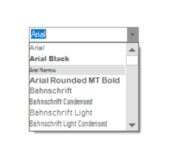

# GettingStarted-WF-FontComboBox
FontComboBox is a comboBox derived control which will be automatically filled with the installed fonts. The entries will also be drawn with the corresponding font styles and If, at a later stage, the control needs to be filled with the installed fonts, the Fill method must be called. For more details please refer [What is FontComboBox](https://www.syncfusion.com/kb/1536/what-is-a-fontcombobox-control).

